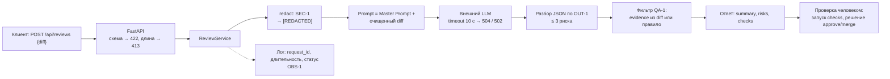

# ADR: решение для первого рабочего сценария

- Статус: proposed
- Дата: 2026-09-21
- Ответственные: автор практики (решение), ревьюеры пары (peer review)

## Контекст

`TRAINING_PR.diff` добавляет `POST /api/reviews` и `ReviewService.review`. Сейчас diff как есть подставляется в prompt (`app/review_service.py:14`), LLM вызывается синхронно без timeout (`:15`), тело запроса — `dict` (`app/api.py:9–10`), ответ — `{"comment": str}` (`:16`). Это нарушает `SEC-1`, `REL-1`, `API-1`, `OUT-1` и даёт 500 на пустое тело. Нужно решение для первого рабочего сценария (см. [`product_management.md`](product_management.md)), которое выполняет правила `CASE.md` и остаётся в рамках `SCOPE-1`: сервис только советует.

## Решение

Оставить один сервис на FastAPI и превратить `ReviewService.review` в линейный конвейер с проверками на каждом шаге; синхронные обработчики сохраняются.

1. **Схема запроса.** `ReviewRequest(diff: str)` на Pydantic; нет поля или не строка → 422.
2. **Лимит.** `len(diff) > 20 000` проверяется в обработчике после разбора схемы и возвращает 413 (`API-1`). Лимит не кладём в схему: Pydantic вернул бы 422.
3. **Очистка.** Функция `redact(diff)` заменяет токены, пароли и приватные ключи на `[REDACTED]` до формирования prompt (`SEC-1`); паттерны хранятся списком в одном модуле.
4. **Prompt.** Master Prompt из [`prompts.md`](prompts.md#master-prompt-v1) + очищенный diff; diff отделён разделителем и помечен как данные.
5. **Вызов LLM.** timeout 10 секунд на вызов клиента (`REL-1`); timeout → 504, любая другая ошибка провайдера → 502, невалидный ответ модели → 502 (`llm_bad_output`). Тело ошибки: `{"error": {"code", "request_id"}}`. **Формат — рабочее допущение**: в `CASE.md` указано только «контролируемый ответ».
6. **Ответ.** Разбор JSON по схеме `OUT-1`: `summary`, `risks` ≤ 3 (`file`, `line`, `evidence`, `risk`), `checks`.
7. **QA-1.** Риск остаётся только если `evidence` — дословная подстрока очищенного diff или `risk` называет правило из списка репозитория; иначе он отбрасывается.
8. **Логи.** `request_id`, длительность, статус; diff и ответ модели не логируются (`OBS-1`).
9. **Границы.** У сервиса нет клиента GitHub и нет ручек approve/merge (`SCOPE-1`).

## Рассмотренные альтернативы

| Альтернатива | Почему не выбрали сейчас |
|---|---|
| Оставить один свободный текст `{"comment": ...}` и доверять модели | Нарушает `OUT-1` и `QA-1`: нельзя проверить, что риск подтверждён строкой diff |
| Агент с доступом к GitHub (читает PR, оставляет комментарии) | Нарушает `SCOPE-1`; шире поверхность атаки и объём проверок |
| `async def` и асинхронный LLM-клиент | Неизвестно, асинхронен ли клиент провайдера; на первом инкременте достаточно sync-обработчиков в пуле потоков с timeout. Вернёмся при росте нагрузки (см. [`tests_load.md`](tests_load.md)) |
| Внешний сканер секретов (gitleaks и аналоги) | Лишняя зависимость для первого инкремента; начинаем с regex-списка и тестового набора, сканер — следующий шаг, если найдём пропуски |
| Один вызов LLM с чанкованием больших diff | `API-1` уже отклоняет diff > 20 000 символов; чанкование не нужно для сценария |

## Последствия и главный риск

- Положительные последствия: предсказуемые коды 422/413/504/502; секреты не покидают сервис; ответ проверяем автоматически; каждое правило `CASE.md` имеет тест.
- Ограничения: синхронные обработчики выполняются в пуле потоков (по умолчанию 40 на процесс — проверить на используемой версии), поэтому число одновременных вызовов LLM ограничено; коды ошибок — допущение до согласования; regex не гарантирует обнаружение всех форматов секретов.
- Главный риск: секрет нестандартного формата пройдёт очистку и уйдёт во внешний LLM (`SEC-1`); вторичный — модель вернёт правдоподобный, но выдуманный риск.
- Как проверим риск: unit-тесты на каталог тестовых секретов (`ghp_`-подобные токены, `password=`, `Authorization: Bearer`, приватный ключ PEM) плюс негативные примеры без секретов; перехват prompt в integration-тесте; для выдуманных рисков — тест `QA-1` (evidence не из diff → риск отброшен). См. [`tests_unit.md`](tests_unit.md), [`tests_integration.md`](tests_integration.md).

## Архитектурная схема

## Как использовали AI

- Для чего: предложить архитектуру и альтернативы к правилам `CASE.md`, сформулировать риск и проверку.
- Тип промпта: RCTF-подобная постановка в Claude Code (P1-05); baseline-замечания модели (P1-01) использованы только для списка альтернатив.
- Строка в [`prompts.md`](prompts.md): [P1-05](prompts.md#L11), сравнение с baseline — [P1-01](prompts.md#L7).
- Что проверили и исправили сами: отброшены предложенные baseline-ом аутентификация, rate limit и `async` как не подтверждённые правилами (`QA-1`) — оставлены лишь как альтернатива с условием возврата; формат ошибок и список паттернов секретов помечены как допущения; число потоков по умолчанию (40) нужно проверить на версии, которая будет использоваться.
