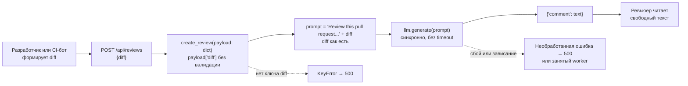
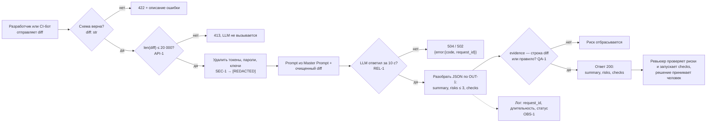

# Анализ процесса: AS IS и TO BE

Процесс: «разработчик или CI-бот получает от помощника быстрое ревью одного PR». Нотация — DFD-стиль на Mermaid `flowchart` (рендерится в GitHub, отдельные исходники и PNG не нужны). Численных замеров времени по AS IS в источниках нет, поэтому задержки описаны качественно.

## AS IS

Участники: разработчик или CI-бот, FastAPI-приложение (`app/api.py`), `ReviewService`, внешний LLM, ревьюер-человек.

Ручные операции и точки потери информации:

- **Вход.** Схемы нет: пустое тело или отсутствие `diff` даёт `KeyError` и 500 вместо 422 (`app/api.py:10`, строка diff 37).
- **Безопасность.** Diff со случайно добавленным токеном или паролем целиком уходит во внешний LLM (`app/review_service.py:14`, `SEC-1`).
- **Надёжность.** Синхронный вызов LLM без timeout и обработки ошибок (`app/review_service.py:15`, `REL-1`) может занять worker и заканчивается 500 без объяснения.
- **Размер.** Лимита нет: большой diff увеличивает время и стоимость (`API-1`).
- **Результат.** Ответ — свободный текст `{"comment": ...}`: ревьюер вручную вычленяет проблемы, нет файла, строки и доказательства; автоматически ответ не проверить (`OUT-1`, `QA-1`).
- **Решение.** Его принимает человек; это верно и должно остаться (`SCOPE-1`).

## TO BE

Один небольшой процесс после изменения: тот же запрос, но каждый шаг ограничен правилом репозитория, а результат проверяем.

## Разница

| Что меняется | AS IS | TO BE | Как проверим изменение |
|---|---|---|---|
| Валидация входа | `payload: dict`, `KeyError` → 500 | Pydantic-схема, 422 | Integration: `POST {}` → 422 ([`tests_integration.md`](tests_integration.md)) |
| Размер diff | Лимита нет | > 20 000 символов → 413 без вызова LLM (`API-1`) | Unit на границе 20 000/20 001; integration: LLM-заглушка не вызвана |
| Секреты | Diff уходит в LLM как есть | Очистка до формирования prompt (`SEC-1`) | Unit: тестовый token → `[REDACTED]`; integration: перехват prompt |
| Надёжность | Нет timeout, 500 | Timeout 10 с, 504/502 с `request_id` (`REL-1`) | Integration: заглушка спит 11 с; load: сценарий зависшего LLM |
| Формат ответа | `{"comment": str}` | `summary`, `risks` ≤ 3, `checks` (`OUT-1`) | Контрактный тест ответа |
| Качество риска | Свободный текст, нет доказательств | Риск только со строкой diff или правилом (`QA-1`) | Unit: `evidence` не из diff → риск отброшен |
| Логи | В diff не показаны | Только `request_id`, длительность, статус (`OBS-1`) | Unit/integration: `caplog` не содержит diff и ответа |
| Решение | Человек | Человек; помощник не approve/merge (`SCOPE-1`) | E2E: нет ручек и действий в GitHub |

## Как использовали AI

- Для чего: описать AS IS по строкам `TRAINING_PR.diff` и предложить TO BE по правилам `CASE.md`.
- Тип промпта: RCTF-подобная постановка в Claude Code (см. P1-05); baseline-ответ — zero-shot P1-01.
- Строка в [`prompts.md`](prompts.md): [P1-05](prompts.md#L11), базовый запуск — [P1-01](prompts.md#L7).
- Что проверили и исправили сами: каждое AS IS-утверждение сверено со строками `TRAINING_PR.diff` (`nl -ba`), ID правил — с `CASE.md`; времена и пропускная способность не заявлены, так как не измерялись.
