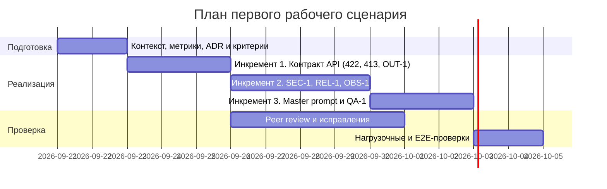

# План поставки

Три инкремента доводят `TRAINING_PR` до сервиса, который соблюдает правила `SEC-1`…`OBS-1`. Каждый инкремент даёт наблюдаемый результат и проверяется тестами из `tests_*.md`. Сроки — оценка автора для учебного плана, не замер.

## Инкременты и ответственность

| Инкремент | Наблюдаемый результат | Что делает человек | Что делает AI или субагент | Проверка | Зависимости |
|---|---|---|---|---|---|
| 1. Контракт API | `POST /api/reviews` принимает схему `{diff: str}`; `{}` → 422; > 20 000 символов → 413; ответ по `OUT-1` (пока с заглушкой LLM) | Утверждает контракт ответа и коды ошибок; принимает ADR | Пишет Pydantic-модели, обработчик и тесты по таблицам `tests_unit.md` и `tests_integration.md` | Unit на границе 20 000/20 001; integration `{}` → 422; контрактный тест `OUT-1` | ADR принят; `TRAINING_PR.diff` как фикстура |
| 2. Безопасность и надёжность | Секреты заменяются на `[REDACTED]` до prompt; timeout 10 с → 504; сбой LLM → 502; логи только `request_id`, длительность, статус | Задаёт список паттернов секретов и формат ошибки (закрывает открытые вопросы из `context.md`); ревьюит код | Реализует очистку, обёртку timeout и логирование; генерирует набор тестовых «секретов» | Unit на паттерны; integration с заглушкой LLM на 11 с; проверка `caplog` (`OBS-1`) | Инкремент 1 |
| 3. Качество ответа | Master Prompt v1 встроен в сервис; риски без строки diff или правила отбрасываются (`QA-1`); ревью `TRAINING_PR.diff` возвращает `SEC-1`, `REL-1`, `API-1` | Оценивает полезность ответов на 5–10 diff, принимает или отклоняет промпт | Прогоняет промпт через OpenCode, сравнивает запуски (как P1-01/P1-02), предлагает правки промпта | E2E из [`tests_e2e.md`](tests_e2e.md); нагрузочные сценарии из [`tests_load.md`](tests_load.md) | Инкремент 2; доступ к LLM-провайдеру |

Разделение ролей: человек принимает архитектуру, коды ошибок, паттерны секретов и merge; AI пишет и проверяет черновики. Сам сервис только советует (`SCOPE-1`).

## Диаграмма Ганта

## Риски плана

- Список паттернов секретов не согласован — без него инкремент 2 не закрывается (открытый вопрос в `context.md`).
- Доступ к LLM-провайдеру и его лимиты: E2E и нагрузку сначала гонять на заглушке.
- Peer review пары идёт параллельно с реализацией; замечания попадают в инкременты 1–2.

## Как использовали AI

- Для чего: разбить работу на инкременты и распределить роли человека и AI.
- Тип промпта: RCTF-подобная постановка в Claude Code (P1-05).
- Строка в [`prompts.md`](prompts.md): [P1-05](prompts.md#L11).
- Что проверили и исправили сами: каждый инкремент привязан к правилам и тестам из соседних файлов; сроки и объёмы — оценки, а не измерения, автору стоит скорректировать их под свою загрузку.
